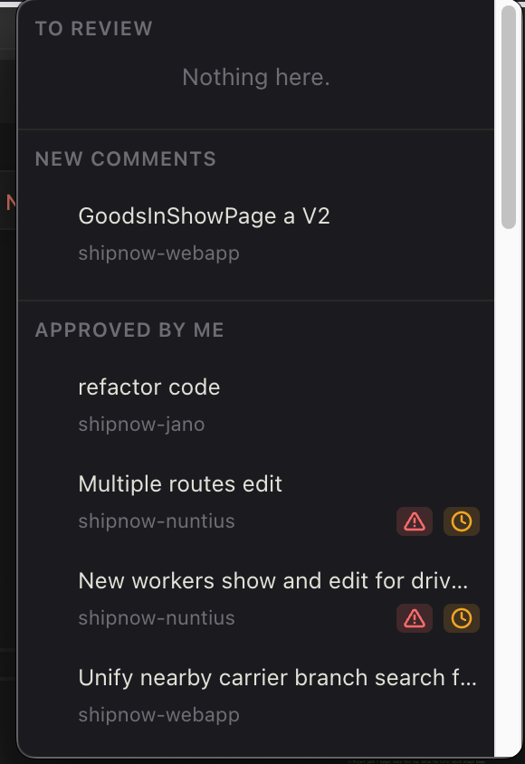
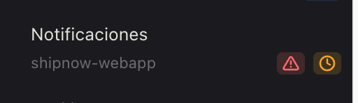
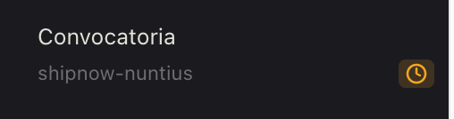
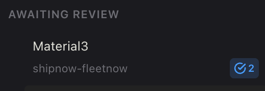

# gitlab-bar

A macOS menu-bar app that watches your GitLab merge requests and shows you what needs attention, without keeping a browser tab open.

Click the tray icon to open a small popup with your merge requests, grouped into categories. It refreshes automatically every 60 seconds.



## Setup

1. Create a GitLab personal access token with `read_api` scope.
2. Launch the app and paste the token in on first run.

Your token is encrypted at rest using your OS's secure storage (Keychain on macOS) and never leaves the app's main process — the UI only ever talks to GitLab through it.

## Categories

- **To Review** — open MRs where you're a requested reviewer, and you haven't approved yet.
- **New Comments** — MRs you're reviewing or authoring that have a comment needing your attention (system notes like pushes/label changes don't count). Review-thread comments (the ones with a "Resolve thread" button in GitLab) are tracked by their actual resolved status — resolve it in GitLab, from any client, and it clears here too. Plain top-level comments have no such concept in GitLab, so those still work the old way: click the row to open it and mark it as seen.
- **Approved by me** — open MRs you've already approved. Just a reference list, no unread-comment tracking.
- **Ready to Merge** — open MRs where you're the assignee, fully cleared: 2+ approvals from other people **and** the `qa_approved` label.
- **Awaiting Review** — every other open MR where you're the assignee: still short on approvals, still waiting on QA, or both. This is also where a freshly-assigned MR with zero approvals and zero comments shows up — it never just disappears.

An MR only disappears from these lists once it's merged, closed, or no longer matches the category's condition (e.g. you approve it, so it moves out of "To Review"; it clears both approvals and QA, so it moves from "Awaiting Review" to "Ready to Merge").

## Badges

Small icon chips on a merge request row — hover one for a one-line explanation:

- **Warning-triangle icon** (red) — the MR has merge conflicts with its target branch. Shown in any category.
- **Clock icon** (orange) — the MR carries the `qa_pending` GitLab label. Shown in any category, not just "Awaiting Review".
- **Checkmark icon + number** (blue) — shown on MRs in "Awaiting Review" that still need more approvals (our team policy requires two before merging). The number is exactly how many are still missing — 2 if it has none yet, 1 if it already has one.

| Merge conflicts | QA pending | Needs approvals |
|---|---|---|
|  |  |  |

## Row layout

- **Title** — always full-width, on its own line, never truncated by badges.
- **Project name + badges** — sit together on the line below the title, next to each other, wrapping onto another line if there isn't room.
- **Project name** — just the repo name (e.g. `shipnow-frontend`), not the full group path — hover it to see the full path.
- Within each section, rows are sorted by project so MRs from the same repo sit next to each other (no sub-grouping, just ordering).

## Staying on top of things without opening the popup

- The tray icon shows a **number** next to it (macOS only) — how many MRs currently need your attention (To Review + New Comments + Ready to Merge). "Awaiting Review" isn't counted — those are waiting on someone else, not on you.
- You get a **native notification** whenever a new MR becomes actionable (several at once are grouped into one notification instead of a burst). Nothing fires on the very first poll after opening the app, to avoid a notification storm for everything already pending.

## Logging out

Right-click the tray icon → **Log out**. This clears the stored token and all local state (last-seen comments, cached username) — the next launch starts fresh.

## Development

### Install

```bash
$ npm install
```

### Run

```bash
$ npm run dev
```

### Type-check

```bash
$ npm run typecheck
```

### Test

```bash
$ npm run test
```

### Build

```bash
# For windows
$ npm run build:win

# For macOS
$ npm run build:mac

# For Linux
$ npm run build:linux
```

For the internal architecture (main/preload/renderer split, how categories and badges are computed, how to add a new one), see [AGENTS.md](./AGENTS.md).
